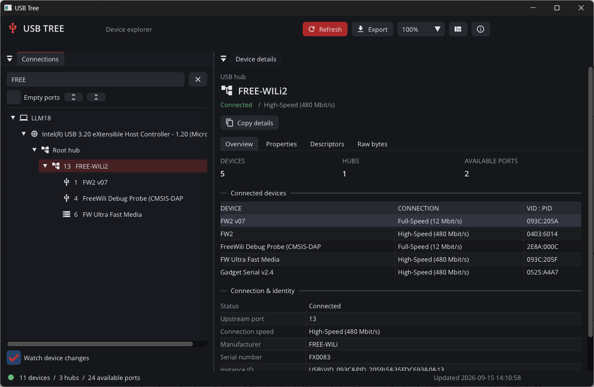

# USB Tree

A native USB topology explorer inspired by [Uwe Sieber's USB Device Tree Viewer](https://www.uwe-sieber.de/usbtreeview_e.html). It shows how your USB devices connect through controllers, hubs and ports, then lets you inspect their identity, connection speed, descriptors and Windows driver properties.

C++20, SDL3, and Dear ImGui **docking**. Windows enumeration works today. The application model and interface are shared; macOS and Linux enumeration backends are still to be implemented.

[Windows downloads](https://github.com/evaderkrub/usbtree/releases) · [MIT license](LICENSE)

## Run the portable application

Copy the **entire USB Tree folder**, then run **UsbTree.exe**. No installer, administrator account, SDL DLL or Visual C++ redistributable is needed for normal inspection. Windows system DLLs are provided by Windows itself.

The release folder is staged at:

    C:\buildfiles\usbtree\release\dist\UsbTree

The distributable ZIP is in:

    C:\buildfiles\usbtree\release\packages

Target: Windows 10/11 x64 with MSVC. Verified on Windows 11 x64. No installation or verification has been performed on macOS or Linux.

## Features

- A dockable controller / hub / port tree, including nested hubs and optional empty ports.
- An inventory of connected devices in each branch.
- Search by name, VID:PID, serial, instance ID, service and collected Windows properties, including child-function names such as COM ports. Multiple search terms must all match the same device; ancestors stay visible.
- Device identity, negotiated USB speed, manufacturer, serial, driver provider/version, PnP status, location, connector and companion-port information where Windows provides them.
- Device descriptors, configuration/interface/endpoint decoding, and raw hexadecimal bytes.
- Read-only inspection with visible warnings for inaccessible hubs or descriptor queries. Failed scans preserve the previous successful snapshot.
- Background scanning, manual refresh and debounced Windows connection/removal notifications.
- Selection preserved across refresh; removal of the selected device returns to the computer overview.
- Copy the selected device report, or export a complete UTF-8 text report.
- GUI scaling from 75% to 200%, plus system display scaling.
- Saved GUI scale, window dimensions, empty-port preference, device-change watching, selection and docking layout.
- A modal About dialog.

### Controls

| Control | Action |
| --- | --- |
| F5 / Refresh | Scan connected USB devices |
| Ctrl+F | Focus device search |
| Ctrl+plus / Ctrl+minus | Increase / decrease GUI scale |
| Scale selector | Set GUI scale |
| Empty ports | Include unused hub ports |
| Expand / collapse icons | Open / close the tree |
| Watch device changes | Refresh after Windows device notifications |
| Copy details / device context menu | Copy the selected device's text report |
| Export | Save the complete report in the portable folder's reports directory |
| Layout icon | Restore the two-pane docking layout |
| Info icon | Open the modal About dialog |
| Escape in About | Close About |

Drag the Connections and Device details tab headers to rearrange or float the panes. Drag their divider to resize them.

All runtime paths are resolved from the **executable directory**, never from the working directory:

- assets/fonts: required fonts and icons, shipped with the app.
- settings/preferences.txt and settings/layout.ini: created when the normal application closes.
- reports: exported reports, with timestamped filenames.
- captures: screenshots requested on the command line.

The application can inspect devices from a read-only folder, but saving reports and settings requires a writable portable folder. Failed writes produce an error; files are never silently redirected to the working directory.

## Build

Install Visual Studio C++ desktop tools, a Windows SDK, CMake 3.24 or newer, and Ninja. Internet access is needed for the first configure. The build script enters the x64 MSVC development environment.

~~~powershell
./scripts/build.ps1 -Configuration Release -Test -Package
~~~

All generated build files, downloads, test output and packages stay under C:\buildfiles\usbtree. The repository stays free of build output.

The script uses CMake presets and Ninja. SDL3, ImGui and the MSVC CRT are statically linked. Application code uses /W4 /WX /permissive-: warnings fail the build. Third-party libraries retain their own warning policy.

Pinned dependency revisions:

| Dependency | Version / revision |
| --- | --- |
| SDL3 | 3.2.28 / 7f3ae3d57459e59943a4ecfefc8f6277ec6bf540 |
| Dear ImGui docking | 1.92.8 / 572f249ce1975f98ad9f8aabce512ffa12a52d6c |
| ImGui Test Engine | 7be88e7fa267f251c7271a33d72b1aa5ca04a4cb |

FetchContent downloads the dependencies at configure time. The application has no runtime downloads. The ImGui Test Engine is linked into a separate console test executable and is excluded from the portable product. Its license is included beside the test executable.

For an assertion-enabled build:

~~~powershell
./scripts/build.ps1 -Configuration Debug -Test
~~~

With a configured MSVC development shell, you can also run cmake --preset windows-release, cmake --build --preset windows-release, and ctest --preset windows-release.

On macOS/Linux the shared UI can be built with CMake/Ninja and run with --demo. The native backend currently reports that enumeration is not implemented there; these builds have not been verified yet.

## Tests and visual verification

CTest runs four test binaries/scripts on Windows:

1. **model_tests**: search and ancestor visibility, topology counts, selection preservation/removal, report generation, descriptor decoding and malformed lengths, scale validation, settings round trips and invalid saved dimensions.
2. **platform_tests**: a live Windows scan, unique node IDs, report writing, and actual controllers/hubs/devices. Hardware counts are observations, not fixed expectations.
3. **usbtree_e2e**: six ImGui Test Engine scenarios against the actual SDL renderer, shared application UI and actions: filtering/selection, empty ports/no results, descriptor tabs/clipboard, About modality, refresh/export, scaling and narrow windows. Deterministic device fixtures allow these tests to run without specific hardware. Clipboard text is restored afterward.
4. **portable_folder**: checks executable imports, copies the product to a Unicode folder, maps a temporary drive letter, launches from another working directory with minimal PATH, and verifies a rendered screenshot. The temporary drive mapping is removed when the test finishes.

Test artifacts are under the selected build directory:

- e2e/test-results/imgui-e2e.xml: JUnit results.
- e2e/captures: screenshots of selection, empty ports, no matches, descriptors, raw bytes, About, narrow layout, 150% scale and maximum zoom.
- test-results/live-topology.txt: the actual machine's USB report.
- portable-check/imports.txt and result.txt: dependency and relocation evidence.

Screenshots have been visually inspected for the live device inventory, populated/empty search states, modal About, narrow layout and enlarged GUI. Automated fixtures verify refresh logic; physically unplugging/reconnecting every device class remains a manual hardware check.

### Development command-line options

~~~text
UsbTree.exe --demo
UsbTree.exe --smoke --capture live.bmp
UsbTree.exe --demo --smoke --capture demo.bmp
~~~

--demo labels the interface DEMO DATA and uses a small deterministic fixture. --smoke renders startup and exits; failed scans/assets return a failure code. Demo and smoke runs do not save preferences. --capture writes a BMP to captures beside the executable.

## Architecture

| Directory | Responsibility |
| --- | --- |
| src/main.cpp | Entry point only |
| src/app | Plain state, filtering, reports, descriptor parsing and settings serialization; no ImGui or OS headers |
| src/ui | All drawing, docking, theme, font setup and SDL/ImGui renderer integration |
| src/platform | SDL window/input, filesystem, clipboard, notifications, Windows SetupAPI and USB hub IOCTL calls |
| assets | Fonts, icon font and notices |
| tests | Console tests and ImGui Test Engine scenarios |
| scripts | Build/package and portable-folder verification |

The drawing code reads and edits plain application state; it does not own the USB snapshot. UI actions request work from the platform loop. Enumeration produces a complete snapshot on a background worker before the UI adopts it. Platform failures return a boolean and a user-visible error string.

The Windows backend follows the topology approach documented by [Microsoft's USBView sample](https://learn.microsoft.com/en-us/samples/microsoft/windows-driver-samples/usbview-sample-application/). Future backends implement platform::enumerate_usb without introducing OS structures into app::Node or the drawing code.

## Current scope

This is a working first Windows version, not full UsbTreeView feature parity. It does not yet implement macOS/Linux enumeration, device eject/restart, drive-letter/volume mapping, USB4/Thunderbolt topology, saved-report import, or audio/video/HID class-specific descriptor decoding. Child PnP functions are listed as properties of their USB device.

Descriptor access and connector details depend on the Windows USB stack and the device. SuperSpeedPlus is shown as 10 Gbit/s or higher; exact 10/20 Gbit/s lane rates are not inferred. Port numbers describe logical hub ports, which may include firmware-defined or internal ports.

## Visual provenance

Open Sans, Fira Code, Material Icons and the Wili Dark theme palette/metrics are copied or adapted from fwcom as requested. See assets/NOTICE.md and the included font licenses. The fwcom source repository was not modified. This is an independent implementation; no UsbTreeView executable or source is redistributed.

## License

USB Tree's project code is licensed under the [MIT License](LICENSE), copyright (c) 2026 Dave Robins. Third-party libraries, fonts and generated icon definitions retain their own licenses and notices; see [asset notices](assets/NOTICE.md), the bundled license files, and the pinned dependencies.
